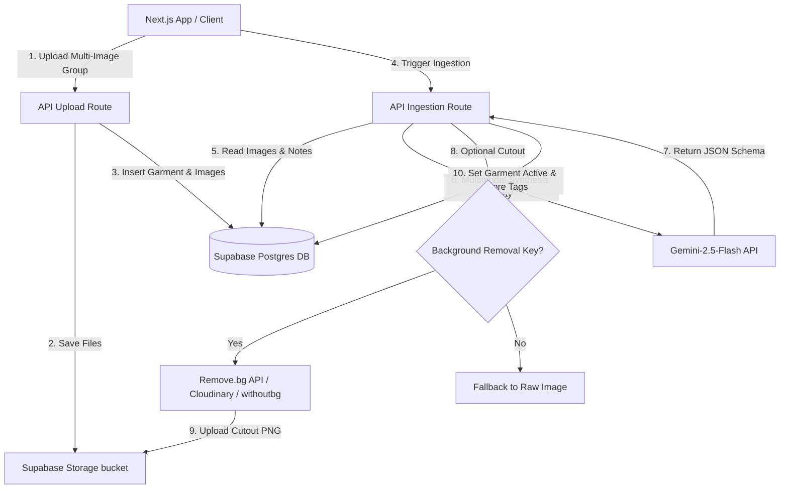

# Antigravity Threads (v2.7)

Antigravity Threads is a premium, data-driven, autonomous personal wardrobe coordinator and styling engine. It combines a modern Next.js App Router frontend with a Supabase PostgreSQL backend, Gemini Multimodal API engines, and Pirate Weather geohash caches.

---

## 🚀 Key Features

* **Asynchronous Multi-Image Ingestion (1:Many)**: Groups multiple files (e.g., wide profile shots, close-up laundry brand/size tags, and material textures) under a single garment record.
* **Gemini Multimodal Synthesis**: Sends grouped image streams concurrently in a single multimodal request to `gemini-3.1-flash-lite` to extract category, color, brand, sizing, and fabric metrics with zero extra token costs.
* **Cost-Per-Wear (CPW) Tracker**: Input garment purchase prices and log wears in one click. Displays live cost-per-wear ratios (`CPW = Price / Wears`) across visual grids and spreadsheets.
* **System Telemetry & Billing Ledger**: Audit API costs, input/output token usage, and request latencies per service from a beautiful collapsible telemetry panel.
* **Saved Outfits**: Save outfit layouts and styling advice recommended by the AI Stylist to your saved outfits archive.
* **Automated Weather Sync**: Syncs browser coordinates, generates an 8-character regional geohash, audits database cache hits, and queries Pirate Weather on cache misses to prevent API key token drains.

---

## 📐 System Architecture



---

## 🖼️ Visual Curation Layouts

* **Interactive Validation Workspace**: View cutout previews side-by-side with confidence metadata tags to make quick selection changes and confirm items.
* **Dual Closet Modes**: Toggles between a visual Polaroid grid and a dense Matrix Spreadsheet grid supporting bulk actions (Archive, Donate, Discard, Delete).
* **AI Stylist & Vibe Presets**: Pick weather details and event presets (Corporate Casual, Weekend Lounge, Date Night, Travel) to instantly generate contrast-balanced outfit options.

---

## 🎨 Background Removal Strategy

To keep background removal clean and cheap, we support three architectures:

1. **Remove.bg API**: Extremely high quality, but limited to 50 free photos on the starter tier.
2. **withoutBG**: An open-source, Apache-2.0 licensed Python library. Highly recommended for developers running local execution servers (`http://localhost:5000`) for unlimited free processing.
3. **Cloudinary (Recommended for Zero-Cost Cloud)**: Has a massive free tier of 25,000 monthly transformations. You can upload photos to Cloudinary and return cutouts by appending `e_bgremoval` to the image URL parameters.

---

## ⚙️ Environment Variables

Add these to your `.env.local` (local) and Vercel Dashboard project settings:

```env
# Supabase Configuration
NEXT_PUBLIC_SUPABASE_URL=your_supabase_project_url
NEXT_PUBLIC_SUPABASE_ANON_KEY=your_supabase_anon_key
SUPABASE_SERVICE_ROLE_KEY=your_supabase_service_role_key

# Gemini AI Engine
GEMINI_API_KEY=your_gemini_api_key

# Weather Geohash
PIRATE_WEATHER_API_KEY=your_pirate_weather_api_key

# Background Removal (Optional)
REMOVE_BG_API_KEY=your_remove_bg_api_key
```
